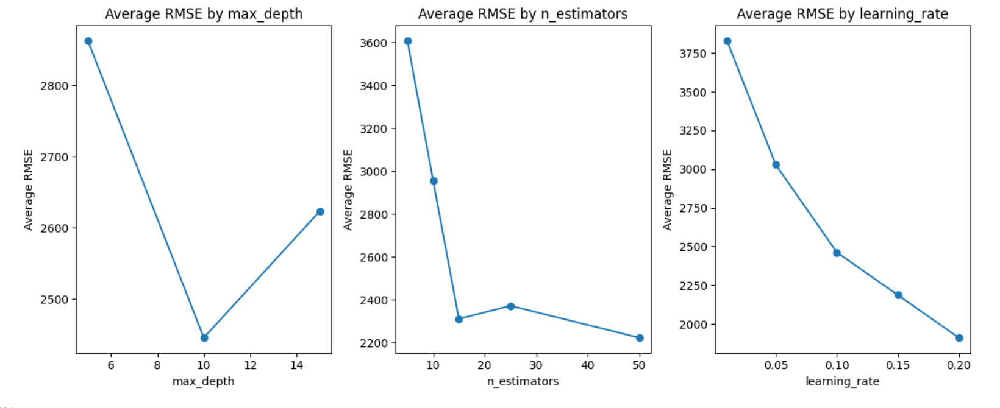
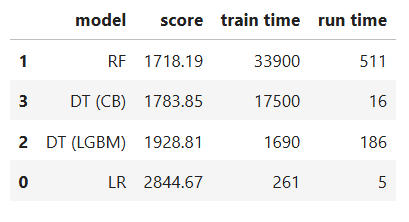

# Sprint 12 Project: Numerical Methods
 
---

### 📚 Table of Contents
- 🔍 [Project Overview](#project-overview)
- 📈 [Conclusion](#conclusion)
- 🖼️ [Sample Outputs](#sample-outputs)
- 📁 [Files](#files)

---

## Project Overview

Rusty Bargain used car sales service is developing an app to attract new customers. In that app, you can quickly find out the market value of your car. You have access to historical data: technical specifications, trim versions, and prices. You need to build the model to determine the value. 

Rusty Bargain is interested in:
- the quality of the prediction
- the speed of the prediction
- the time required for training

---

## Conclusion

The purpose of this project was to train a model to predict car values from historical data for the Rusty Bargain used car sales service. I did that by preparing the data for modeling, training several models, and comparing their speed and quality.

The data provided were suitable for modeling but required significant preparation. Questionable or outright impossible values for RegistrationYear, Power, RegistrationMonth, and PostalCode features needed to be trimmed or recoded and the NumberOfPictures feature was dropped altogether because it provided no useful information. A large number of missing values in categorical features were recoded so they could be included in the models as separate categories.

Although LGBM and CatBoost gradient boosting implementations deal with categorical features natively, the data needed to be further encoded for the linear and random forest regression models to run properly. Features with datetime data types were recoded to the number of days since the earliest date in the dataset because raw timestamps are not handled well. Categorical features with fewer than 10 unique categories were subjected to One Hot Encoding but doing so for features with many categories was impractical. Instead, target encoding replaced categorical values with the mean value for each category. In the end, the dataset contained 31 properly encoded features, a manageable number for modeling purposes. All models were trained on the encoded data for simplicity and consistency.

Using RandomizedSearchCV to search for optimal hyperparameters, I explored a relatively constrained hyperparameter space to avoid excessive training times. Several values of the n_estimators and max_depth hyperparameters were tried for all models and several values of learning_rate were added for the gradient boosted models. All models performed best with the most complex hyperparameter configurations attempted, but simpler configurations offered reasonable performance. Because this project is concerned with efficiency as well as scores, I chose hyperparameters that balanced between those factors. The final model specifications were as follows: random forest regressor (n_estimators = 25, max_depth = 20; RMSE = 1760), LGBM decision tree regressor (n_estimators = 25, max_depth = 10, and learning_rate = 0.15; RMSE = 1926), CatBoost decision tree regressor (n_estimators = 25, max_depth = 15, and learning_rate = 0.20; RMSE = 1808). The random forest model was the best scoring during training but it took almost 20 minutes to optimize hyperparameters, followed by CatBoost at almost 16 minutes, and LGBM at 3 minutes.

Finally, I tested all three models against a linear regression model as a sanity check. The random forest regressor scored best (RMSE = 1718), followed by CatBoost (RMSE = 1784), LGBM (RMSE = 1929), and linear regression (RMSE = 2845). The linear regression model was the fastest to train (261 ms), followed by LGBM (1,690 ms), CatBoost (17,500 ms), and the random forest regressor (33,900 ms). The linear regression model was also the fastest to make predictions (5 ms), followed by CatBoost (16 ms), LGBM (186 ms), and the random forest regressor (511). The best model depends on which attribute is most valued. The random forest scored best, the linear regression ran fastest, and the two gradient boosted decision trees balanced both considerations, with CatBoost scoring better and predicting faster than LGBM but taking longer to train.

I recommend that Rusty Bargain implement a version of the CatBoost decision tree regressor model. It offers the best balance of performance, providing reasonably fast and accurate predictions. It trains somewhat sluggishly but since that only needs to be done once, it should have no effect on the final product.

---

## Sample Outputs

Here are two key moments from the analysis:

  
*Average RMSE across training runs for different max depths, numbers of estimators, and learning rates. Best results cluster near depth=10, n=50, and lr=0.2.*

 

  
*Comparison of final model candidates. Random Forest and CatBoost offer the best RMSE, with CatBoost achieving near-optimal results in a fraction of the runtime.*

---

## Files

📄 See the full analysis in [`sprint-12-project.ipynb`](./sprint-12-project.ipynb)  
📄 Or view a static version in [`sprint-12-project.html`](./sprint-12-project.html)  
📄 Project background: [`project-description.md`](./project-description.md)

> Note: This project uses one CSV file, which is included in the `/data/` folder.  
> See [`/data/README.md`](./data/README.md) for details.
